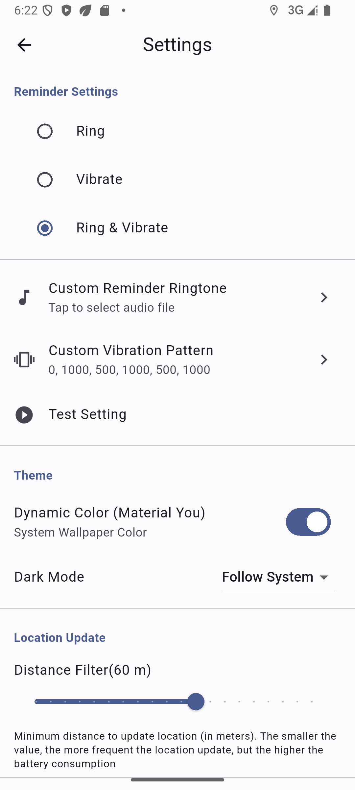

# 🦊 Triggeo · Lightweight & Dynamic Area Trigger Reminder [中文](./README.md)|English

A **compact and elegant** map application that reminds you when entering preset areas.
> This project started with me **missing my stop** and walking an extra **kilometer**...

---

## ✨ Features

- 🧭 **Lightweight Interaction** — Simple map operations  
- 🎯 **Smart Triggering** — Instant notifications when entering preset areas  
- 🎨 **Visually Refreshing** — Smooth animations and polished interface built with Flutter  
- 📦 **Offline Capable** — Core functions work without internet connection  
- 🌐 **Localization Support** — Support for multiple languages(Simple Chinese, Traditional Chinese, English, German, Japanese, Korean)

---

## 🗺️ Core Features

- Freely select areas on the map
- Set area names and trigger radii
- Real-time location tracking with silent monitoring
- Local notifications when in designated areas
- Completely offline location detection

---

## 🚀 Quick Start

```bash
# Clone the project
git clone https://github.com/yusuaois/triggeo.git

# Install dependencies
flutter pub get

# Run the application
flutter run
```

> **Note**: iOS requires location permission configuration in `Info.plist`, Android requires setting up permissions in `AndroidManifest.xml`.
> **Note**: The project uses Flutter 3.8.0+ to build, please note your development environment issues.

---

## 📱 Application Preview



---

## 🧩 Project Structure

```
lib/
├── core/           # Utilities & constants
├── data/           # Data layer (models, storage)
├── features/       # Feature modules
│   ├── map/        # Map interactions
│   ├── reminders/  # Reminder module
│   └── settings/   # Settings
├── l10n/           # Localization
└── main.dart       # Application entry
```

---

## 🌱 Design Philosophy

**Triggeo** embraces "less is more":

- Focused functionality: Specialized in area trigger reminders
- Lightweight interaction: Responsive clicks, smooth animations
- Visual restraint: Soothing colors, appropriate spacing, clear hierarchy

---

## 📄 License

MIT © 2025 AnchialC  
Issues and PRs are welcome to help improve this application.

---

## 🌟 Acknowledgments

Thanks to the Flutter community and all open-source map service providers.  
If you find this application useful, please consider giving it a Star ⭐.

---

> Triggeo · A lightweight spatiotemporal awareness assistant.