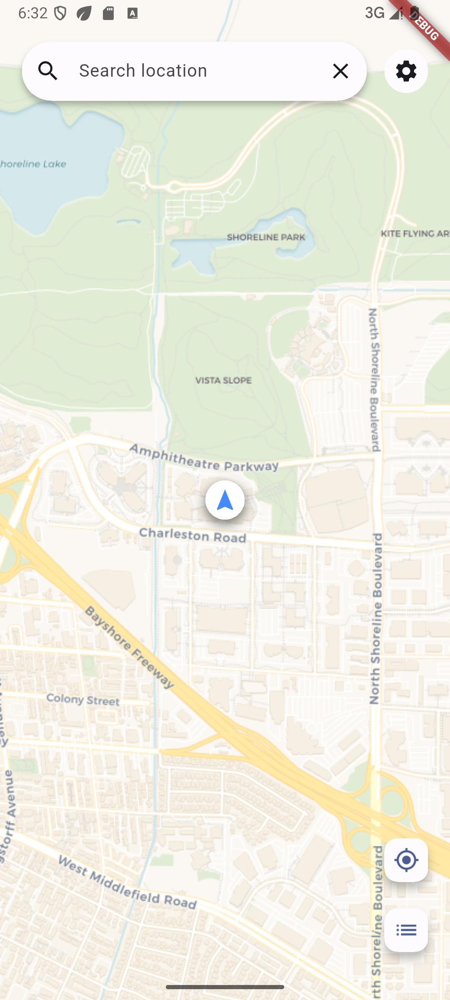

# 🦊 Triggeo · 轻巧灵动的区域触发提醒 中文|[English](../README.md)

一个**小巧、精致**的地图应用，在进入预设区域时进行提醒。

---

## ✨ 特点

- 🧭 **轻量交互** — 简捷的地图操作
- 🎯 **智能触发** — 进入预设区域即时推送提醒
- 🎨 **视觉清新** — Flutter 构建的流畅动画与细腻界面
- 📦 **离线可用** — 基础功能无需网络支持

---

## 🗺️ 核心功能

- 在地图上自由选择区域
- 设置区域名称与触发半径
- 实时位置跟踪与静默区域状态监测
- 处于区域时的本地通知提醒
- 完全离线的位置检测

---

## 🚀 快速开始

```bash
# 克隆项目
git clone https://github.com/yusuaois/triggeo.git

# 安装依赖
flutter pub get

# 运行应用
flutter run
```

> **提示**：iOS 需要配置 `Info.plist` 定位权限，Android 需要设置 `AndroidManifest.xml` 中的权限。  
> **注意**：项目使用 Flutter 3.8.0+ 构建，请注意您的开发环境问题。

---

## 📱 应用预览



---

## 🧩 项目结构

```
lib/
├── core/           # 工具类与常量
├── data/           # 数据层（模型、存储）
├── features/       # 功能模块
│   ├── map/        # 地图交互
│   ├── reminders/  # 提醒模块
│   └── settings/   # 设置
├── l10n/           # 本地化
└── main.dart       # 应用入口
```

---

## 🌱 设计理念

**Triggeo** 追求“小即是美”：

- 功能专注：专注于区域触发提醒
- 交互轻盈：点击反馈，动画顺滑
- 视觉克制：柔和的色彩、恰当的留白、清晰的层次

---

## 📄 许可

MIT © 2025 AnchialC  
欢迎提交 Issue 和 PR，一起让这个小应用更美好。

---

## 🌟 致谢

感谢 Flutter 社区与所有开源地图服务提供者。  
如果这个小应用对你有用，不妨点个 Star ⭐ 鼓励一下。

---
 
> Triggeo · 轻巧的时空感知助手。
